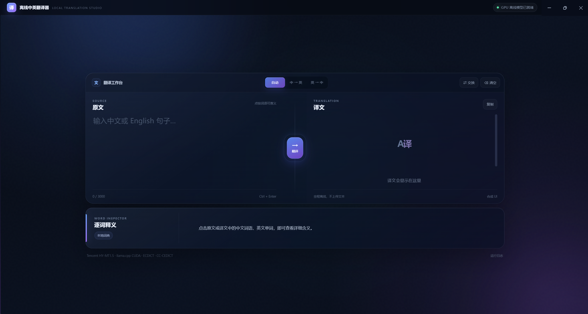
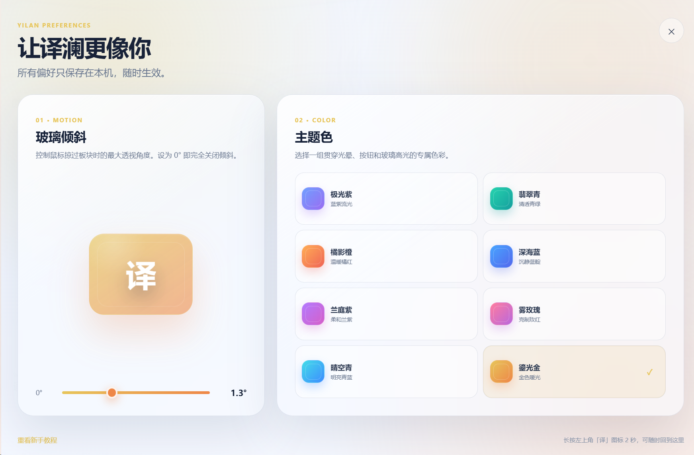

# 译澜 Yilan

**让语言，在本地自然流动。**

一款面向 Windows 的离线中英互译桌面应用：支持句子翻译、逐词释义、独显 / 集显 / CPU 自适应推理，以及带动画的现代玻璃 UI。

> [!IMPORTANT]
> 完整离线版内置 Tencent HY-MT1.5 模型。该模型许可明确排除欧盟、英国和韩国，且仅允许在许可定义的 Territory 内使用和分发。下载或使用完整安装包前，请先阅读 [Tencent HY Community License](app/third_party/TENCENT-HY-LICENSE.txt)。

## 界面预览

## 功能

- 中文 ↔ English 句子级离线翻译，文本不上传
- 启动窗口后自动预热模型，降低首次翻译等待
- Vulkan 独显 / 集显推理，并在不可用时自动回退 CPU
- 点击原文或译文中的词语查看本地逐词释义
- 八种主题色、亮暗模式、可调玻璃倾斜角度
- 首次启动随机主题与全窗口新手引导；之后始终保留用户偏好
- 主题色同步生成桌面快捷方式图标
- GPU 合成的玻璃、悬浮、圆形主题揭示与微动效
- 支持磁盘根目录或任意父文件夹安装，并自动创建 `Yilan` 子目录

## 安装与使用

> 完整安装包包含受地域限制的 Tencent HY-MT1.5 模型，因此不在这个全球公开仓库提供下载。它保存在仓库所有者的私有 `Yilan-Offline-Release` 仓库中，仅可在模型许可定义的 Territory 内受控分发。

1. 从有权访问的私有 Release 获取 `Yilan-v1.6.0-Full-Offline-Setup.exe`（显示标签：译澜 v1.6.0 完整离线安装包）。
2. 运行安装器，选择磁盘或父文件夹；译澜会自动创建 `Yilan` 子文件夹。
3. 首次启动会展示一次新手教程，并在窗口出现后自动加载模型。
4. 输入中文或英文句子，选择自动检测或固定方向后翻译；点击句子中的词可查看释义。

完整包约 1.22 GiB，已包含模型、词典、Vulkan 与 CPU 推理运行库，新电脑安装后无需联网下载组件。

## 硬件兼容

| 设备 | 推理路径 | 说明 |
|---|---|---|
| NVIDIA / AMD / Intel 独显 | Vulkan | 优先使用可用独显 |
| Intel / AMD 集显 | Vulkan | 可用时自动选择 |
| 无可用 Vulkan 设备 | CPU | 自动回退，不要求独立显卡 |

右上角状态只显示当前实际采用的推理类型，并保留绿色就绪指示灯。

## 从源码构建

仓库只保存应用和安装器源码，不把模型、词典数据库、Electron/llama.cpp 二进制及构建产物写入 Git 历史。准备这些资源和构建环境的步骤见 [BUILDING.md](BUILDING.md)。

## 数据与隐私

- 翻译与查词均在本机完成。
- 不上传输入文本，不依赖云端翻译 API。
- 设置保存在当前 Windows 用户的本地应用数据目录中。

## 第三方组件与许可

- [Tencent HY-MT1.5](https://huggingface.co/tencent/HY-MT1.5-1.8B) — Tencent HY Community License
- [llama.cpp](https://github.com/ggml-org/llama.cpp) — MIT License
- [ECDICT](https://github.com/skywind3000/ECDICT) — MIT License
- [CC-CEDICT](https://cc-cedict.org/) — CC BY-SA 4.0
- Electron / Chromium / Node.js — 各自许可证

详细归属与声明见 [NOTICE.txt](app/third_party/NOTICE.txt)。译澜由 **MOFAN** 提供；Tencent 与本项目不存在隶属、关联、赞助或认可关系。

## 应用源码权利

Copyright © 2026 MOFAN. All rights reserved.

本仓库公开源码用于查看、审阅与问题反馈；除第三方组件各自许可明确授予的权利外，未授予复制、修改、再分发或商业使用译澜应用代码的许可。

---

Designed By MOFAN

